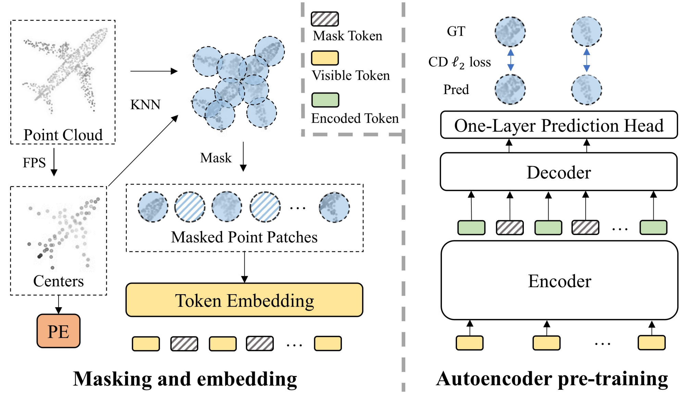

# Analysis of PointMAE

## Introduction

掩码自编码作为一种很有前途的自监督学习方案，在自然语言处理和计算机视觉方面具有显著的进步。***受此启发，我们提出了一种用于点云自监督学习的掩蔽自动编码器的简洁方案，以解决点云特性带来的挑战，包括位置信息泄漏和信息密度不均匀。具体来说，我们将输入点云划分为不规则的点斑块，并以高比例随机屏蔽它们。然后，一个基于 Transformer 的标准自动编码器，具有非对称设计和移动掩码标记操作，从未屏蔽的点补丁中学习高级潜在特征，旨在重建屏蔽的点补丁。***大量的实验表明，我们的方法在预训练期间是有效的，并且在各种下游任务中可以很好地推广。具体来说，我们的预训练模型在 ScanObjectNN 上实现了 85.18% 的准确率，在 ModelNet40 上实现了 94.04% 的准确率，优于所有其他自监督学习方法。我们通过我们的方案展示了一个完全基于标准 Transformer 的简单架构可以超越监督学习的专用 Transformer 模型。我们的方法还将小镜头物体分类中最先进的精度提高了 1.5%-2.3%。此外，我们的工作启发了将语言和图像的统一架构应用于点云的可行性。


Transformer最初用于文本生成。给出数个单词，然后根据模型预测出可能的下一个单词(实际上是许多可能及其对应的可能性)，然后不断重复这样的操作就能创造文本。在论文的场景中，将一个点云进行部分（并且是高比例）的遮掩，然后尝试利用Transformer的方法来学习未被遮掩的部分的特征，从而复原原来的点云模型。这种想法是自然的，因为transformer已经用于了文本、音频和图片的“遮挡+学习+复原”的任务了。


自监督学习从未标记的数据中学习潜在特征，而不是基于人类定义的注释构建表示。它通常是通过设计一个pretext任务来预训练模型，然后对下游任务进行微调来完成的。自监督学习对标记数据的依赖较少，显著提高了自然语言处理（NLP）[11,4,32,33]和计算机视觉[28,3,8,18,7,2,17,49]。其中，图1所示的掩码自动编码[17,49,2]是一种很有前途的语言和图像方案。它随机屏蔽了一部分输入数据，并采用自动编码器来重建与原始屏蔽内容相对应的显式特征（例如像素）或隐式特征（例如离散标记）。由于屏蔽部件不提供数据信息，因此此重建任务使自动编码器能够从未屏蔽部件中学习高级潜在特征。此外，屏蔽自动编码的强大功能归功于其自动编码器的骨干网，该主干采用Transformers[40]架构。例如，NLP 中的 BERT [11] 和计算机视觉中的 MAE [17] 都应用了屏蔽自动编码，并采用标准 Transformer 架构作为自动编码器的骨干，以实现最先进的性能。


屏蔽自动编码的思想也适用于点云自监督学习，因为点云本质上与语言和图像共享一个共同的属性（见图1）。具体来说，承载信息的基本元素(token?)（即点、词汇表和像素）不是独立的。相反，相邻元素形成一个有意义的子集来呈现局部特征。与局部要素一起，完整的元素集构成了全局要素。因此，在将点子集嵌入到token中后，可以使用语言和图像进行类似的处理。此外，考虑到点云的数据集相对较小，屏蔽自编码作为一种自监督学习方法，可以自然地满足作为自编码器主干的 Transformers 架构的大数据需求。事实上，最近的一项工作Point-BERT [54]尝试了一种类似于掩码自动编码的方案。该文提出一种BERT式的预训练策略，即屏蔽点云的输入token，然后采用Transformer架构预测掩码token的离散token。然而，这种方法相对复杂，因为它需要在预训练之前训练基于DGCNN [44]的离散变分自动编码器（dVAE）[35]，并且在预训练期间严重依赖对比学习和数据增强。此外，在预训练过程中，来自其输入的屏蔽令牌会从Transformers的输入进行处理，导致位置信息过早泄露，计算资源消耗高。与他们的方法不同，更重要的是，为了将掩码自编码引入点云，我们旨在设计一种简洁高效的掩码自编码器方案。为此，我们首先从以下几个方面分析了点云引入掩码自编码的主要挑战：

（i） 缺乏统一的变压器架构。与NLP中的Transformers[40]和计算机视觉中的Vision Transformer（ViT）[12]相比，Transformer的点云架构研究较少，而且相对多样化，主要是因为小数据集无法满足Transformer的大数据需求。与之前使用专用 Transformer 或采用额外的非 Transformer 模型来辅助的方法不同（例如 Point-BERT [54] 使用额外的 DGCNN [44]），我们的目标是完全基于标准 Transformer 构建自动编码器的骨干，它可以作为点云的潜在统一架构。

（ii） 掩码token的位置嵌入导致位置信息泄露。在屏蔽的自动编码器中，每个屏蔽的部分都由一个共享加权的可学习掩码标记替换。所有掩码token都需要通过位置嵌入在输入数据中提供其位置信息。然后经过自动编码器处理后，使用每个掩码标记来重构相应的掩码部分。对于语言和图像来说，提供位置信息不是问题，因为它们不包含位置信息。虽然点云在数据中自然具有位置信息，但位置信息泄露以掩盖token使重建任务变得不那么具有挑战性，这对自动编码器学习潜在特征是有害的。我们通过将掩码标记从自动编码器编码器的输入转移到自动编码器解码器的输入来解决此问题。这延迟了位置信息的泄漏，并使编码器能够专注于从未屏蔽的零件中学习特征。

（iii） 与语言和图像相比，点云以不同的密度携带信息。语言包含高密度信息，而图像包含大量冗余信息[17]。在点云中，信息密度分布相对不均匀。构成关键局部要素的点（例如，尖角和边缘）包含的信息密度比构成不太重要的局部要素（例如，平面）的点高得多。换言之，如果被屏蔽，在重建任务中，包含高密度信息的点更难恢复。这可以在重建示例中直接观察到，如图 2 所示。以图2的最后一行为例，masked的桌面（左）可以很容易地恢复，而masked摩托车的车轮（右）的重建要差得多.

尽管点云包含的信息密度不均匀，但我们发现高比例（60%-80%）的随机掩蔽效果很好，这与图像惊人地相同。这表明点云在信息密度方面类似于图像而不是语言。在分析的驱动下，我们通过设计一种简洁高效的掩蔽自动编码器方案（Point-MAE），提出了一种新型的点云自监督学习框架。如图 3 所示，我们的 Point-MAE 主要由点云遮蔽和嵌入模块以及自编码器组成。将输入点云划分为不规则的点斑块，以高比例随机屏蔽，以减少数据冗余。然后，自编码器从未屏蔽的点面片中学习高级潜在特征，旨在重建坐标空间中的屏蔽点面片。具体来说，我们的自动编码器的主干完全由标准Transformer模块构建，并采用非对称编码器-解码器结构[17]。编码器仅处理未屏蔽的点面块。然后，将编码的标记和掩码标记作为输入，具有简单预测头的轻量级解码器重建掩码点补丁。与从编码器输入处理掩码令牌相比，将掩码令牌转移到轻量级解码器可以节省大量计算，更重要的是，避免了位置信息的早期泄露。我们的方法是有效的，预训练的模型在各种下游任务上都很好地泛化了。在对象分类任务中，我们的Point-MAE在真实数据集ScanObjectNN的最难设置下实现了85.18%的准确率，在干净的对象数据集ModelNet40上实现了94.04%的准确率，优于所有其他自监督学习方法。同时，Point-MAE超越了所有来自监督学习的专用Transformers模型。

## PointMAE

**输入前的处理步骤：**

1. ShapeNet里的点云先用FPS（Farthest Point Sampling）采样1024个点
2. 再采用FPS，采样得到64个point patches的中心点
3. 采用KNN算法，得到每个中心点的32个邻近点，构成point patches
4. 通过64个point patches中心点通过一个MLP得到positional embedding
5. random mask 60%的point patch中心点
6. 被mask的point patch用一个可学习的mask token代替，另外的visible point patches通过一个mini-PointNet得到其embedding



**PointMAE的处理步骤：**

1. visible tokens + 其对应的positional embedding，输入进Encoder**（注意：每个Encoder的Transformer Block都要输入这个positional embedding），**得到embedded tokens
2. embedded tokens和mask tokens进行concatenation，并加上对应的positional embedding，进入解码器（同理，这里positional embedding也要输入进每一个Transformer Block）
3. **仅mask tokens得到的embedding**，要通过一层MLP（prediction Head），进行reconstruction loss的计算

最后重建的符合比率用Chamfer Distance 来衡量：


# 代码部分

核心是Point_MAE.py, 定义了model, 这个model会用在配置文件yaml里面。

例如``pretrain.yaml``

````yaml
optimizer : {
  type: AdamW, # AdamW优化器
  kwargs: {
  lr : 0.001, # 学习率
  weight_decay : 0.05 # 学习率衰减
}}

scheduler: {
  type: CosLR, # 调节器
  kwargs: {
    epochs: 300,
    initial_epochs : 10
}}

dataset : { # 使用ShapeNet进行train val and test 
  train : { _base_: cfgs/dataset_configs/ShapeNet-55.yaml,
            others: {subset: 'train', npoints: 1024}},
  val : { _base_: cfgs/dataset_configs/ShapeNet-55.yaml,
            others: {subset: 'test', npoints: 1024}},
  test : { _base_: cfgs/dataset_configs/ShapeNet-55.yaml,
            others: {subset: 'test', npoints: 1024}}}

model : {
  NAME: Point_MAE, # 使用的模型
  group_size: 32,
  num_group: 64,
  loss: cdl2, # 损失函数类型
  transformer_config: {
    mask_ratio: 0.6, # 掩码比例，设置为0.6，表示在自监督学习中将掩码掉60%的输入
    mask_type: 'rand', # 随机掩码
    trans_dim: 384,
    encoder_dims: 384, # 编码器维度！
    depth: 12, # Transformer编码器的深度
    drop_path_rate: 0.1, # Dropout路径率，设置为0.1，用于正则化
    num_heads: 6, # 注意力机制中的头数，设置为6
    decoder_depth: 4,
    decoder_num_heads: 6,
  },
  }
npoints: 1024
total_bs : 512
step_per_update : 1
max_epoch : 300
````

## Encoder

`Encoder`类通过两个顺序的卷积层（`self.first_conv`和`self.second_conv`）来实现这一功能。

````python
	self.first_conv = nn.Sequential(
            nn.Conv1d(3, 128, 1), # 将输入的3维特征（点云中的x, y, z坐标）转换成128维的特征，使用1维卷积
            nn.BatchNorm1d(128), # 批量归一化层，用于规范化上一层的输出
            nn.ReLU(inplace=True), # 参数inplace=True意味着ReLU的计算将在输入数据的内存位置上直接进行
            nn.Conv1d(128, 256, 1) # 将128维的特征进一步转换成256维
        )
	self.second_conv = nn.Sequential(
            nn.Conv1d(512, 512, 1), # 512 = 256(first_conv得到) +(concat) 256(maxpooling)
            nn.BatchNorm1d(512),
            nn.ReLU(inplace=True),
            nn.Conv1d(512, self.encoder_channel, 1) # 将512维的特征转换成encoder_channel维，这个维度是模型配置中指定的
        )

def forward(self, point_groups):
        # 前向传播函数，处理输入的点云数据并生成特征表示
        '''
            point_groups : B G N 3
            其中B是批次大小,G是每个批次中的组数,N是每个组中的点数,3是因为每个点的坐标是三维的
            -----------------
            feature_global : B G C
        '''
        bs, g, n , _ = point_groups.shape
        point_groups = point_groups.reshape(bs * g, n, 3) # 将所有的点云组展平为一个长序列
        # encoder
        feature = self.first_conv(point_groups.transpose(2,1))  # BG 256 n
        # 将维度从(bs * g, n, 3)转换为(bs * g, 3, n)，这是因为nn.Conv1d期望第一个维度是通道数
        feature_global = torch.max(feature,dim=2,keepdim=True)[0]  # BG 256 maxpooling
        # [0]引索能够去掉最后一个维度
        feature = torch.cat([feature_global.expand(-1,-1,n), feature], dim=1)# BG 512 n
        feature = self.second_conv(feature) # BG 1024 n
        feature_global = torch.max(feature, dim=2, keepdim=False)[0] # BG 1024
        return feature_global.reshape(bs, g, self.encoder_channel)
````

过程是： 3维——128维（使用1×1卷积）—— （归一化）——（ReLU）——256维（使用1×1卷积）——maxpooling——512维（concat）——1024维（1×1卷积）

这样就是实现了将点云数据通过一个嵌入模块来获取特征表示

## FPS+KNN

````python
batch_size, num_points, _ = xyz.shape
# fps the centers out
center = misc.fps(xyz, self.num_group) # B G 3  G是self.num_group
# knn to get the neighborhood
_, idx = self.knn(xyz, center) # B G M 只关心索引，不关心实际的距离
````

首先使用FPS找到中心点，然后使用KNN找到邻域点.

## Transformer

每个Transformer块包含自注意力机制和多层感知机。`Block`类将`Attention`和`Mlp`组合在一起，并添加了DropPath正则化。

`Mlp`类定义了一个标准的MLP，包括两个线性层和一个激活函数；而`Attention`类实现了多头自注意力机制，包括查询（Q）、键（K）、值（V）的生成和注意力分数的计算。

Encoder实现了embedding, 递交给了transformer的encoder。联想自学的transformer。

另外，Point_MAE.py里面也定义了TransformerEncoder and Decoder

## Point_MAE

`Point_MAE`是论文中提出的自监督学习模型，结合了`MaskTransformer`、`Group`、`TransformerDecoder`和损失函数来实现自监督学习。

``@MODELS.register_module()``表示正在使用一个名为 `MODELS` 的注册表来管理模型类。当定义一个模型类并使用 `@MODELS.register_module()` 装饰它时，这个模型类就会被注册到 `MODELS` 中，以便可以通过名称来检索和使用它。

可以通过 `MODELS.get('Point_MAE')` 来获取这个模型类的实例。

## PointTransformer模型（微调模型）

`PointTransformer`类使用了与`Point_MAE`类似的结构，但专注于分类任务，并包含了从预训练模型加载权重的逻辑。

## Loss Function

在`Point_MAE`类的`__init__`方法中，通过`build_loss_func`函数构建了损失函数。

````python
def build_loss_func(self, loss_type):
    if loss_type == "cdl1":
        self.loss_func = ChamferDistanceL1().cuda()
    elif loss_type =='cdl2':
        self.loss_func = ChamferDistanceL2().cuda()
    else:
        raise NotImplementedError
        # self.loss_func = emd().cuda()
````


最后大部分的注释过的代码放在了code文件里面（重要的我都尝试去理解代码是在干什么了）

