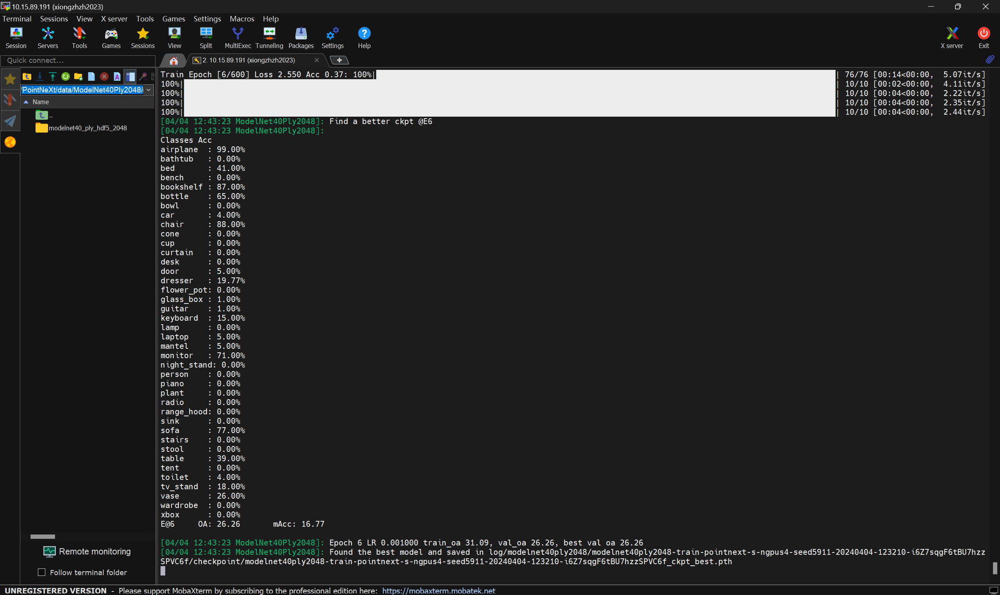

# Log

[PointNeXt: Revisiting PointNet++ with Improved Training and Scaling Strategies | Papers With Code](https://paperswithcode.com/paper/pointnext-revisiting-pointnet-with-improved)

首先看README文件， 想要安装环境：

````bash
git clone --recurse-submodules git@github.com:guochengqian/PointNeXt.git
cd PointNeXt
source update.sh
source install.sh
````

但是在进入了计算节点之后发现报错：

``please make sure you have the correct access``

因此尝试开始解决问题：

````bash
git config --global user.name "yourname"

git config --global user.email "your@email.com" 
````

``git config --list # 注意确保邮箱不是在双引号里面``

``ssh-keygen -t rsa -C "your@email.com"（请填你设置的邮箱地址）``

会出现： 

``Generating public/private rsa key pair.``

``Enter file in which to save the key (/Users/your_user_directory/.ssh/id_rsa):``

然后登录自己的github，在settings里面找到SSH and GPG keys，进入

然后将``.SSH/id_rsa.pub``里面的东西复制进去，然后点击``Add SHH key``

然后``ssh -T git@github.com``

最后就能成功连接了（如果不行，**试一下重启**）

（后记：后来发现，计算节点确实是任何下载或者网址都连接不上，因此可能是要退出计算节点的原因；对应的，如果conda环境下载什么东西，最好是在登陆节点下载）


然后git clone之后按照流程，发现gcc版本很低；因此将software中的git配置到环境变量里面

注意： 是/.../bin:$PATH, $PATH代表环境变量，这句话代表在最前面加上gcc路径

因为系统是从PATH的左到右去找能够发现的gcc!


本来以为能够开始实验了，但是却发现运行程序前还有一大堆的包需要安装

``pyyaml wandb tqdm multimethod termcolor h5py scikit-learn easydict tensorboard shortuuid``然后发现报错： 

``Importerror： cannot import Literal from typing `` 

原来发现环境的python版本太低，应该至少3.8，因此只能重新``conda install python=3.8``

并且要重新下载``conda install setuptools=y59.5.0``


但是又报错： multimethod中的一个地方有： 

````bash
TypeError: ABCMeta is not subscriptable
````

经过大量尝试，才发现是python版本的问题，升级到3.9就解决了。。


然后又报错： ``libstdc++.so.6: version `GLIBCXX_3.4.30'``

直接将scipy的版本降到1.7.3   ``conda install scipy==1.7.3``; 但是还是发生问题！

归根结底，我们需要conda下载最新版的gcc, 然后将env里的bin和lib相对应地添加到PATH & LD_LIBRARY_PATH

后来提示要先运行python setup.py install， 但是提示``cc1plus``错误，因为要相同的GCC G++版本

又因为CUDA11.3 build的时候不能支持过高版本的GCC G++， 我还临时改路径；最终运行成功


接下来提示安装``chamfer``的库，这个库的安装有点不一样，还需要``python setup.py install``

最后手动下载modelnet的数据集（由于计算节点不能联网，所以什么都不做然后跑第一次，会报错无法连接上一个下载这个数据集的网站，因此我们手动连接上这个网站就可以了）最后就成功了

最后可以在conda里面Install一个``nvitop``, 然后单独开一个窗口，进入计算节点+conda环境，输入``nvitop``就能看到显卡的运行情况: 


为了显卡能够充分利用功率，可以适当提高batch_size的大小，一般是以*2的形式尝试



终于，终于，跑通了


上面是训练完成的时候


上面是test的结果
