# Sequence Model

序列模型无处不在, 例如音频, 生成文字段落, 等等, 这些数据都是跟序列息息相关 

## Notation 

假如说有一个在句子中找到人名的任务, 输入的是一个包含了9个单词的token, 输出的是, 假如说, 是9个token来表示各自是否是人名的一部分. 那么在这个情景中, 输入的x每一个都是``x^<i>``记号用来表示, y同理. 那么有的是时候处理的数据很多, 那么圆括号就是代表第几个样本, 然后尖括号代表第几个token. 

那么很自然的就能提出疑问: 如何用``x<i>``, 来代表一个单词呢? 

一种直观的解决方法是创建一个字典, 从a, 第一个单词开始, 一直到最后, 假如说是Zulu, 每一个都编上号. 一般来说, 常见的商务公司所使用的字典, 差不多数量在30000-50000, 那么100000以上的也并不少见. 

那么有了这个字典, 那么就可以采用独热编码(One Hot). 假如说我们采用的字典是10000的体量, 那么上面这个例子中, 输入的9个单词中, 每一个单词都可以用10000维的向量表示, 其中只有单词所对应的索引的行数为1, 其他地方都是0. 

那么相当于最后是训练一个从x到y的一个映射. 那么如何训练这样的一个映射呢? 值得注意的是, 这应该是一个监督学习, 因为x y 其实都应该是有标准答案, 且我们会人工标记上去的. 那么因此, 我们引出了RNN

## Recurrent Neural Network

那么首先直觉上可能提出疑问: 为什么不用之前现有的network frame呢? 之前的MLP不是挺好的嘛? 但是主要是有两个问题: 第一个是输出的y的feature的数量其实是不确定的(不是所有的任务都是像这一个任务一样, y输出的feature的数量和x的一样); 第二个是这样的神经网络无法学习positional information, 因为原来的神经网络是permutation-insensitive的, 但是序列却对permutation异常敏感. 

那么什么是RNN ? 

y1的输出来源于x1, 但是到了y2的时候, 不仅仅它的推理来源于x2, 还要源于前一个模块所传递过来的a1, 然后就这样一直以此类推. 那么对于y1来说, 它的推理其实也需要一个a0, 但是一般这个a0都是零初始化. 

值得注意的是, 输入的x需要经过一层映射处理, 才能进入网络, 而这个映射矩阵的参数是共享的; 同样, 输出y的时候, 其实是输出内容经过一层映射处理才变成y的, 而这层映射矩阵也是参数共享的; 更是不仅仅如此, 传递``a<t>``的时候, 也是某种输出经过映射矩阵变成的, 而这层映射矩阵的参数也是共享的. 共享是什么意思? 意思指的是每一个模块中的这个矩阵的参数总是一样的

在有些教科或者论文中, 为了方便, 将RNN表示成右边这个样子. 

在这个模型中, 发现y3的输出与x1 x2 x3有关, 这是一件非常乐于见到的事情. 但是也有缺点. 有的时候, 其实序列模型的"序列问题"不仅仅是后面的token和前面的有关, 有的时候(且不少见)前面token的含义也和后面的token有关, 但是这一点在模型中没有体现. 图中列举出了一个很生动的例子, 关于Teddy究竟是不是人名. 

那么为了解决这种弊端, 我们可以考虑双头循环网络(BRNN), 这个之后会介绍. 

那么``Wax Waac Wya``参数起到的作用究竟是什么呢?  注意到字母的排列有点奇怪, 因此首先先明确字母的含义: 第一个字母代表: 用来计算什么; 第二个字母代表: 这个矩阵是乘在谁身上. 

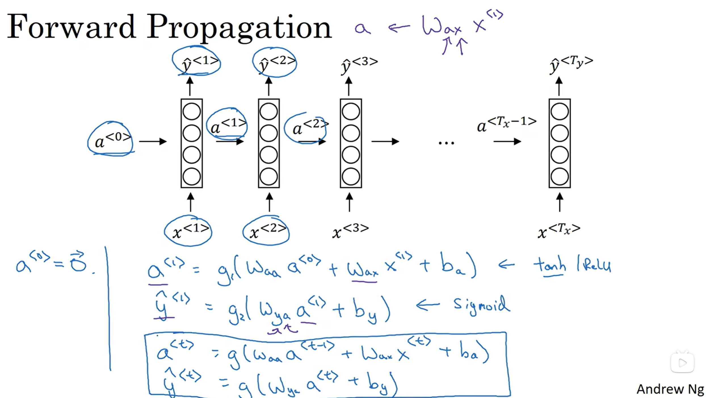

``a<t> y<t>``的计算式子已经放在了图片里面, 其中g代表激活函数, 那么这个激活函数在计算``a<t>``的时候大多是tanh函数, 很少但是也可以用ReL:U函数; 而对于``y<t>``来说, 主要取决于输出类型是什么, 是softmax还是sigmoid, 都有可能. 

为了进一步简化符号以用来表示复杂的网络, 用向量化的形式进一步简化: 

 ## Backward Propagation through time 

虽然说在实际的编程中, 我们完全不需要知道backward propagation究竟是怎么进行的, 因为pytorch功能过于强大. 但是最好还是稍微了解一下反向传播究竟是如何进行的

向前传播的过程之前已经说过, 那么关于损失函数, 依然使用的是各自的交叉熵函数; 之后反向传播过程与之前的方向完全相反, 以这个来实现链式法则的求导, 来计算出各个节点的参数的delta值, 最后实现梯度下降和参数更新. 因为之前正向传播的方向正好是时间方向, 因此反向传播就有了一个非常fancy的名字: Backward Propagation through time.

## 不一样的RNN

之前介绍和分析的这种情况都是Tx = Ty, 即输入的token数量和输出的token数量一致. 但是很多情况并不是这样. architecture分为很多种, 例如many-to-many(之前的那个就是), 也有many-to-one(例如sentiment classification, 最后输出的是一个正整数, 代表心情好坏程度)

当然还有one-to-many, 例如输入一个正整数代表音乐风格, 然后输出是一段音频. 在many-to-many中还有一种非常特殊的结构, 首先用encoder读入这句话, 然后再用decoder输出翻译的内容, 这种结构最出名的使用在不同于语言之间的翻译, 因为翻译的句子之间的token数量非常有可能是不一样的. 

## Language model and sequence generation

一个良好的语音识别系统在听到一句话之后会计算出各种可能句子的概率, 然后再比较概率最后输出最有可能的文本. 那么如何建立这样的模型呢? 首先, Training set需要是一个包含英语文本的非常大的语料库(corpus). 

对于语料库的每一个句子, 首先我们需要tokenize, 即用one hot编码. 但是值得注意的是, 最后可以加上一个``<EOS>``的token, 代表此处是End of Sentence. 同时, 如果发现了字典里面没有的单词, 可以用``<UNK>``token代表Unknown

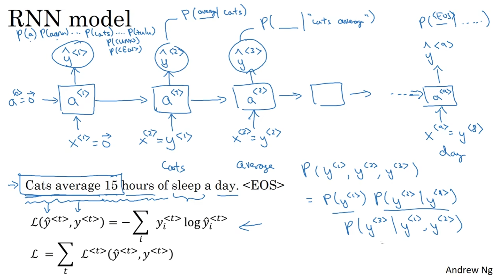

这里训练的目的是: 告诉Cat, 然后生成后面一个单词; 错了没关系, 我再告诉你, Cat 后面是 Average, 那么Average后面又是什么呢? 这样的话就能计算一堆的条件概率. 

## Vanishing Gradient & GRU

英语的句子能做到非常长, 例如上面这个例子, 我们希望网络能够学到: 后面是was 还是 were是需要根据前面cat的单复数来决定的, 但是网络非常深, 因为中间单词非常多, 于是深度很高,导致梯度容易爆炸, 因此反向训练很难进行. 

为了结局这个问题, GRU(Gated Recurrent Unit)应运而生, 它改变了RNN的隐藏层, 能敏感捕捉深层连接, 并且极大缓解梯度爆炸的问题. 

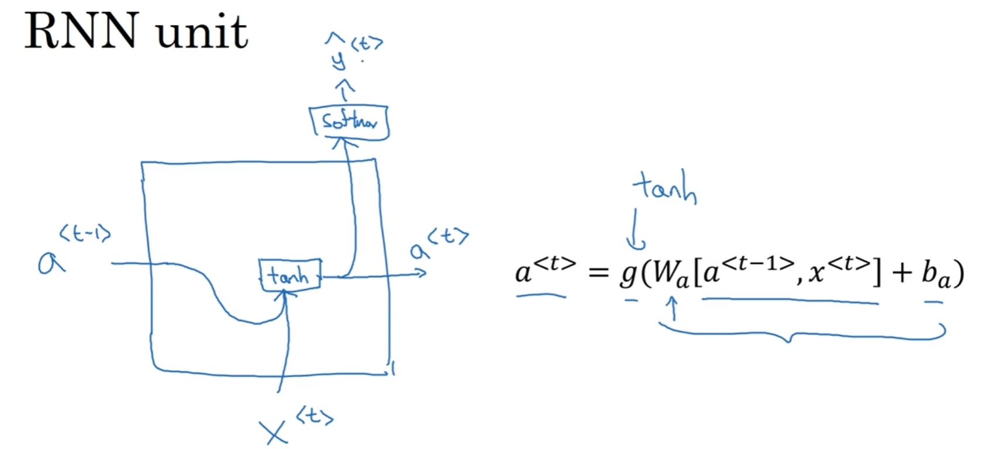

这个是原来RNN设计的隐藏层, 在输入上一层的a和这一层的x之后, 通过权重矩阵和bias matrix, 加上激活函数tanh之后得到了下一层将会使用的a, 并且这个输出还会经过softmax从而得到预测的y. 

在这个GRU单元中, 首先是引入了memory cell的参数, 这个矩阵参在这个模型中和a是一样的. 然后有一个"门", 输入的是上一层传下来的memory cell和这一层输入的x, 然后经过sigmoid function得到门值, 最后由门值得到了传给下一层的memory cell

这个设计成功实现了一个目标: 就是决定什么时候更新记忆细胞. 因为sigmoid function下得到的数值要么非常接近1要么非常接近0, 所以说上图中的第三个式子其实几乎就是在决定到底是保留上一个记忆细胞还是更新记忆细胞. 这样一来的话,cat处的"是单数"的信息就可以通过记忆细胞传到"was"所处在的位置, 那么生成was/were的时候就会更新记忆细胞, 然后输出正确的was

上面图中的演示图也是很好的展现了simplified GRU的内部结构. 

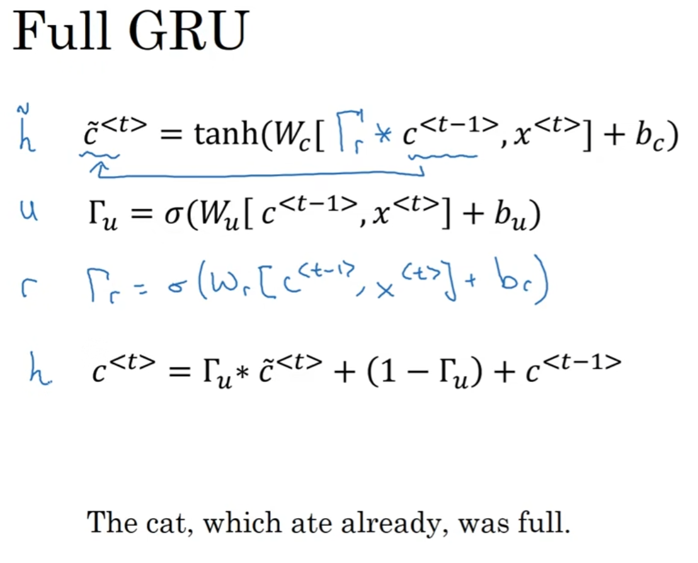

但是为什么说是简化的版本? 因为其实完整的版本是如上图所示的. 因为其实网络设计的结构没有标准答案, 经过多年来研究者的尝试, 最后发现, 在计算c tilder的时候, 在上一层的memory cell matrix前面乘上一个r(stands for relationship)门, 会增加鲁棒性且展现较强的准确性. 

附: 其中*代表的是element-wise multiplication

## LSTM   

LSTM全称为Long-Short-Term-Memory. 

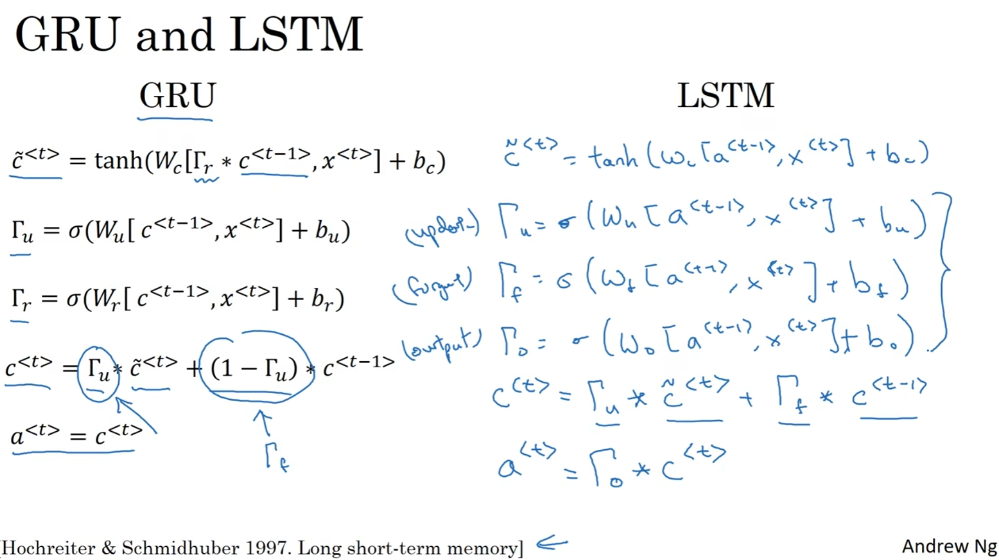

可以的看到, 貌似LSTM就是把(1-门u)这个参数和a=c的identical projection matrix换成了单独训练出来的参数. 所以说, LSTM是更加广泛的GRU版本

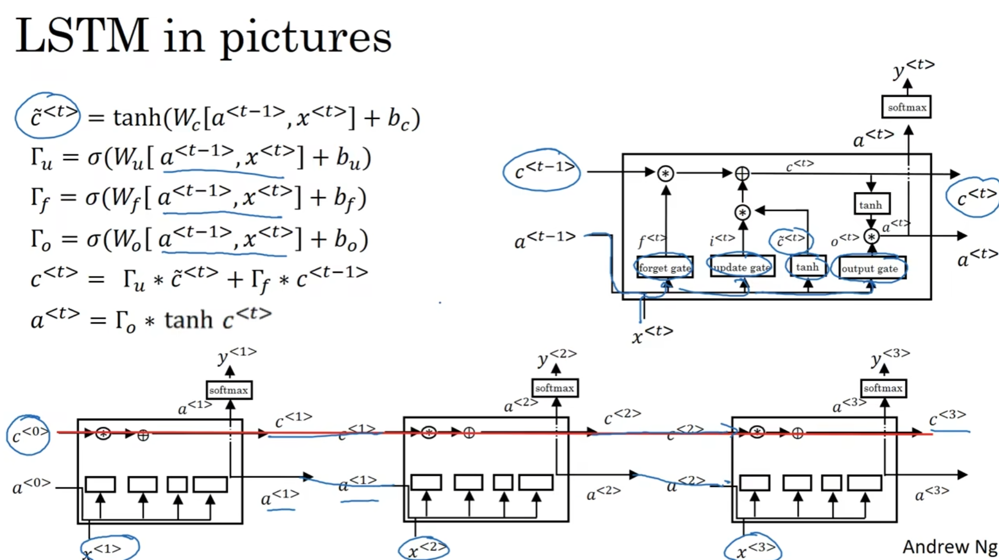

上图中展示了LSTM的结构, 但是说实话还是公式更加明显.

值得一提的是, 输出门(output)处理c后是为了softmax而服务的.  

## Bidirectory RNN

之前说过, 有的时候前面的内容也和后面的内容有关, 因此时间从左到右是不完全的, 因为刚刚说的这种需求并没有体现或者说满足. 

那么计算将会从头两头都各自开始, 注意, 这里从右到左的计算对于另一头来说是正向传播; 换而言之, 这个网络的正向传播和反向传播都是两个方向上面都会进行的. 

当然, 输出yhat的方法当然要更改, 将两个``a<t>``进行拼接,然后经过权重矩阵和bias, 通过softmax最后给出预测. 这种思路其实相当straight

## Deep RNN

之前的网络设计已经十分不错了, 但是为了鲁棒性, 我们需要纵向更深一点的网络, 即拟合出来更复杂的权重和偏差矩阵. 

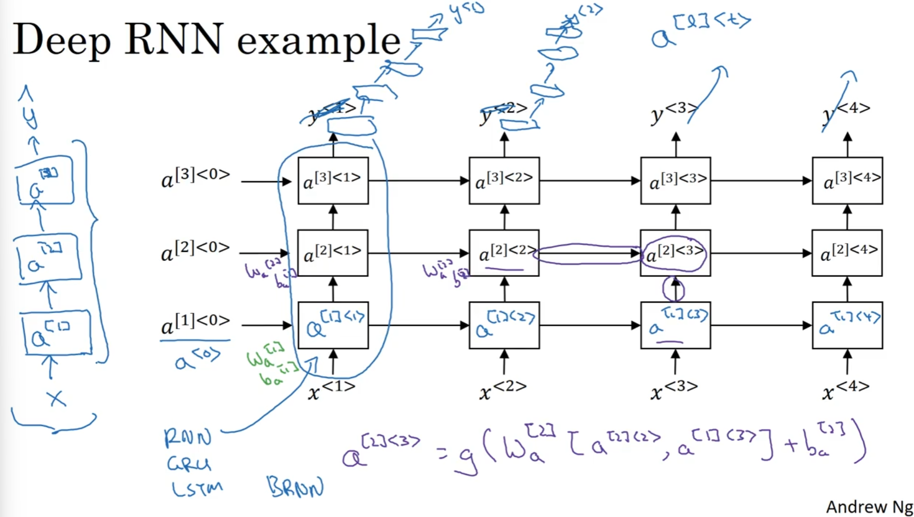

可以看到, 最下面的一行就是之前谈到的RNN网络, 然后这样的网络能够堆叠. 对于其中的一些单元, 例如``a[2]<3>``来说, 它接受的时候, ``a[1]<3> a[2]<3>``是需要拼接然后经过权重和偏差矩阵和激活函数的. 值得注意的是, 一行里面的权重和偏差矩阵是共享的. 当然, 每一个单元可以选择LSTM OR GRU. 

# NLP and Word Embedding 

## Word representation

之前, 单词的表达形式都是one-hot 独热编码. 这种建立corpus的方式当然是一种很好的解决方法, 但是它也有缺点: 它把每个单词都孤立起来, 导致模型的泛化能力很差. 

任意两个独热编码向量的内积都是零, 代表这两个向量线性无关, 但是直觉上这有点不对劲. 因为明显, 苹果和橙子应该是两个非常接近的单词, 但是两个单词的独热编码向量却毫无关系, 这合理吗? 

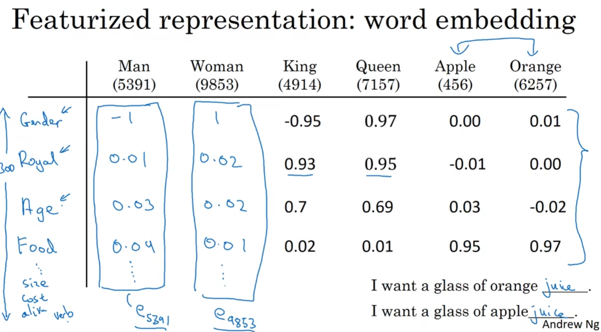

看上面这张图, 不难发现, 我们尝试用一种"特征归类"来给每一个单词画上标签. 这种思维其实很容易认同, 因为其实我们人类认知事物也是有相似的规律的. 那么在遇到上图右下角的例子, 模型容易轻松知道两个地方都是Juice, 因为苹果橙子的特征向量在绝大部分上面都是十分接近的. 

## Property of words embedding

词嵌入还有这意想不到的性质, 比如说相似度analogy

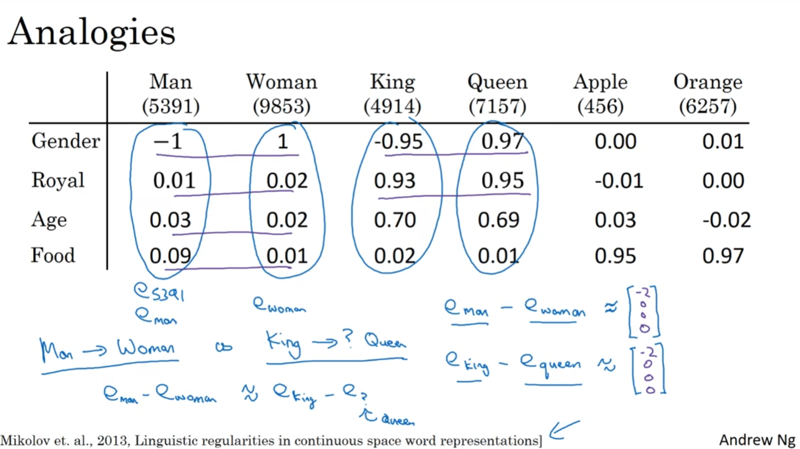

可以发现, 有了这种词嵌入表达形式, 词与词之间的关系都盘活了. 

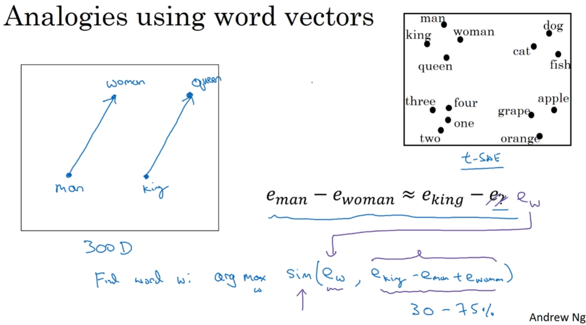

可以发现, 单词的"相近程度"几乎等价于两个向量相等, 因此找到这个单词w就可以使用:

``argmax(...) // 图中的式子``, 值得注意的是, 这个记号在论文中非常常见 
值得一提的是, 左边这个示意图其实不是二维中的, 实际上是高维中的两个平行向量. 那么事实上, 有没有潜空间维度映射到二维的映射? 有, 叫做t-SNE, 但是这个映射非常复杂而且非常的非线性, 所以说映射过来的这两个向量绝大部分情况下是没办法指望平行了. 

那么这个算法叫做``cosine similarity``, 如图: 

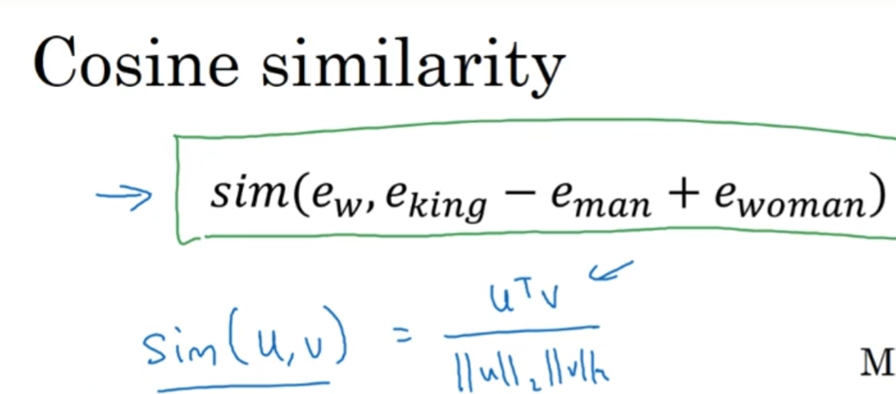

说白了, 就是求高维中两个向量的余弦夹角, 然后这个角尽可能地为0, 所以说是cos值尽可能地大(尽可能接近1)

## Embedding Matrix 

那么我们尝试将独热编码嵌入潜空间中的时候, 事实上我们是在训练一个嵌入矩阵: 

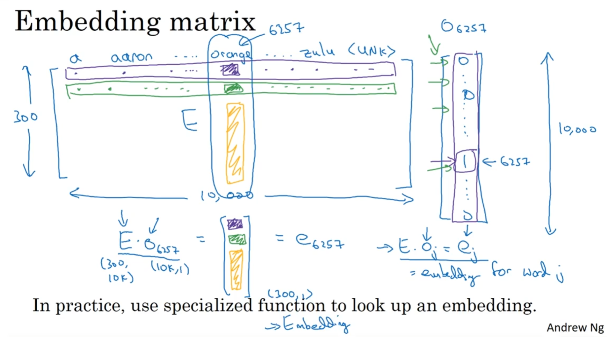

有了这个矩阵, 那么乘以独热向量就可以获得潜空间维度的向量, 那么如何训练这个矩阵呢? 

历史上, 一开始有非常多复杂的算法尝试学习这个矩阵, 但是随着不断的努力, 算法越来越简介; 那么先从冗杂的算法开始说起: 

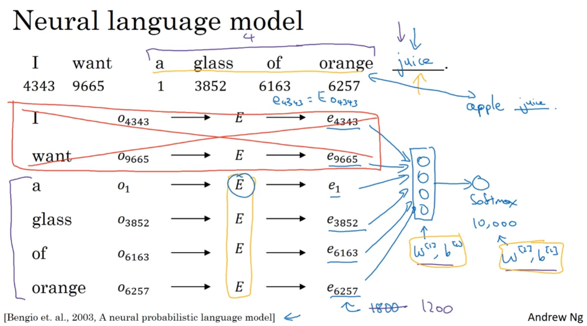

如上图, E矩阵一开始是随机初始化的, 然后乘在每个独热向量上面, 得到潜空间维度的矩阵. 然后**固定一个历史窗口**, 只关注几个单词(这是一个hyperparameter), 来预测下面一个单词. 然后这几个单词——这里是四个——向量堆叠在一起, 形成一个1800维度的向量, 然后输入进一个神经网络, 最后经过一个softmax, 然后希望它预测出来的结果是juice. 

注意的是, 所有独热向量乘上的E都是权重共享的, 并且这个神经层和softmax层的权重和偏差都是共享的. 所以这也貌似解释了为什么要设计历史窗口了: 要权重能共享, 说明维度不能改变, 那么就干脆规定输入进的单词数量.

这个算法其实已经很好了. 不妨设想, 训练的时候, 语料库里面一般来说Juice前面出现的单词一般都是苹果香蕉梨等水果, 这样的话, 学习的时候, 这些水果的嵌入后的向量就应该十分接近. 这正是我们希望的嵌入矩阵能够实现的目标. 

那么在选"哪些词作为提示"方面, 算法就可以有非常多了, 例如接下来的word2vec

接下来, 要隆重介绍word2vec model了

## word2vec model 

### skip-gram

在一个句子里面选定一个context, 其作为输入x; 然后在一定范围内选取一个地方的单词作为y, 然后希望模型能够输入x, 然后预测y

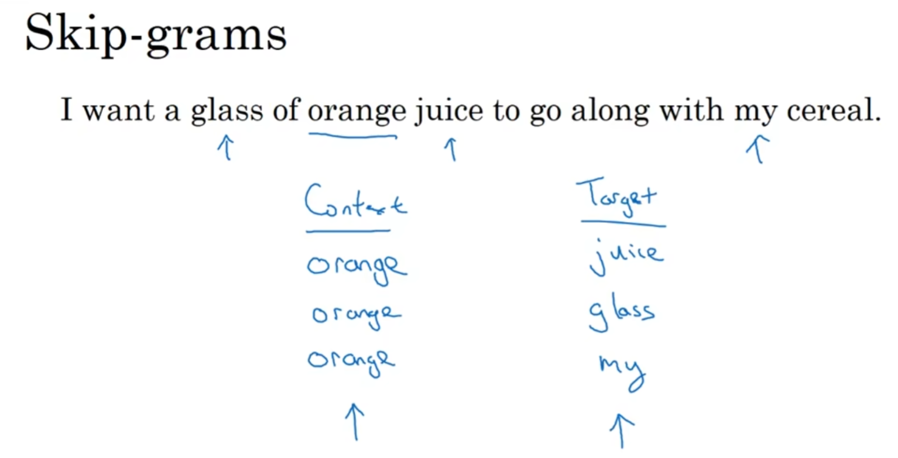

但是有两个细节值得提, 见下图: 

首先就是在softmax的时候,因为要所有的值都要计算e^x, 相当于你要遍历整个语料库(vocab_size)个数字, 这简直是灾难! 因此设计了一种hierarchical softmax:(from kimi)

1. **构建二叉树**：首先，需要构建一个二叉树，其中每个节点代表一个类别。树的结构通常取决于类别之间的层次关系。
2. **编码路径**：对于树中的每个节点，我们定义一个0或1的编码来表示从根节点到该节点的路径。在二叉树中，向左子节点的路径用0表示，向右子节点的路径用1表示。
3. **计算得分**：对于输入样本，模型首先通过一些参数（通常是神经网络的权重）计算每个节点的得分。这个得分是通过一个可学习的权重向量和输入特征的点积得到的。
4. **路径得分**：对于目标类别，模型会计算从根节点到该类别节点的路径上所有节点的得分。这是通过将路径编码与节点得分进行点积来实现的。
5. **归一化**：使用路径得分，模型计算从根节点到目标类别的路径上所有可能路径的概率。这是通过将路径得分通过一个非线性激活函数（通常是sigmoid函数）来实现的，从而确保所有路径的概率之和为1。
6. **损失函数**：在训练过程中，模型的目标是最小化损失函数，通常是交叉熵损失。对于每个样本，损失是其真实类别路径的负对数似然。
7. **反向传播**：通过反向传播算法来更新模型的权重，以减少损失函数的值。

其次就是选择context的手法了, 虽然说直觉上来看, 随机选不就好了吗? 但是转头一想, 如果真的是这样, 那么a the is are he she等单词将会出现非常多次, 但是apple orange出现的次数就会相对来说较少, 甚至是durian(榴莲)这种单词出现的次数会微乎其微, 但是我们又其实十分希望模型学到durian这个单词的特征的. 

因此在context单词的选择分布上面, 其实是会做手脚的. 

### Negative sampling

这是一个完成了skip-gram完成了的任务, 但是却更加简单的算法. 

在选择context之后在范围内再选出一个单词的基础之上, 我们在字典里面随机选一些单词, 然后标记关系为0. 相反地, context和选出的单词的关系就是1. 

字典里面选出多少个呢? 一般来说, 语料库越小, k越大

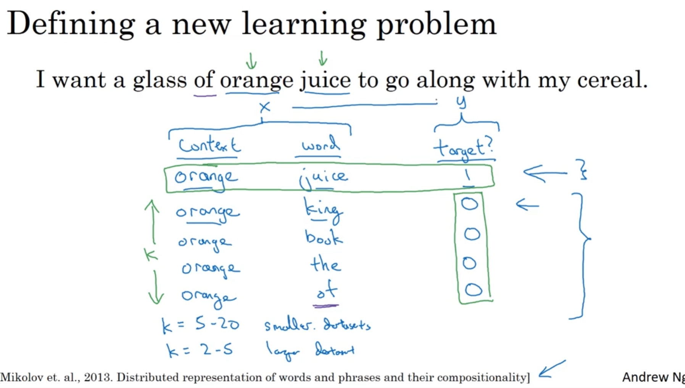

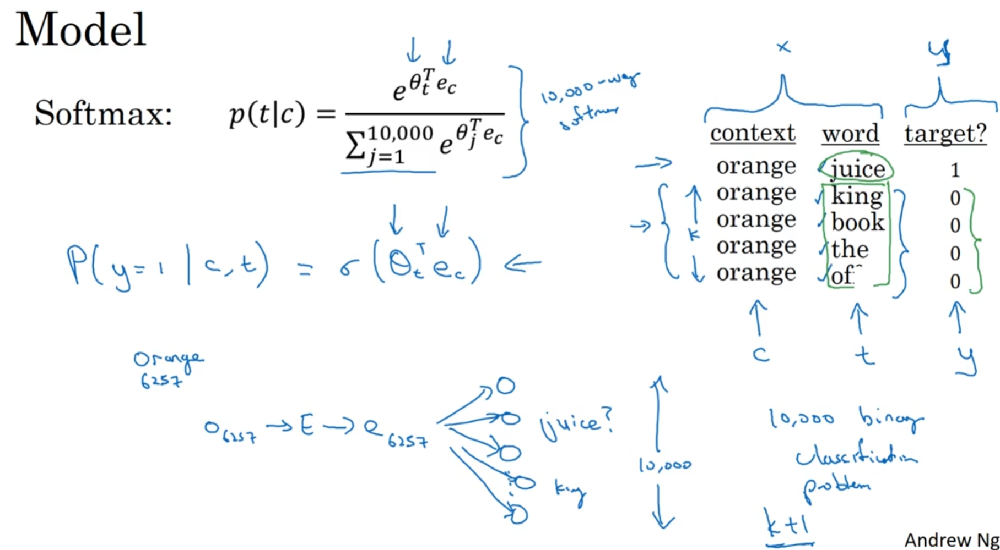

使用了负采样之后, 不再计算softmax了, 而是转化为训练10000个logistic regression了. 每一次训练中, 有k个负样本, 那么就会训练1+k个二分器的参数. 因此计算量极大减少了. 

值得注意的是, "随机从字典里面选单词"仍然不应该真的是"随机". Emperically, 选中单词的概率分布如下: 

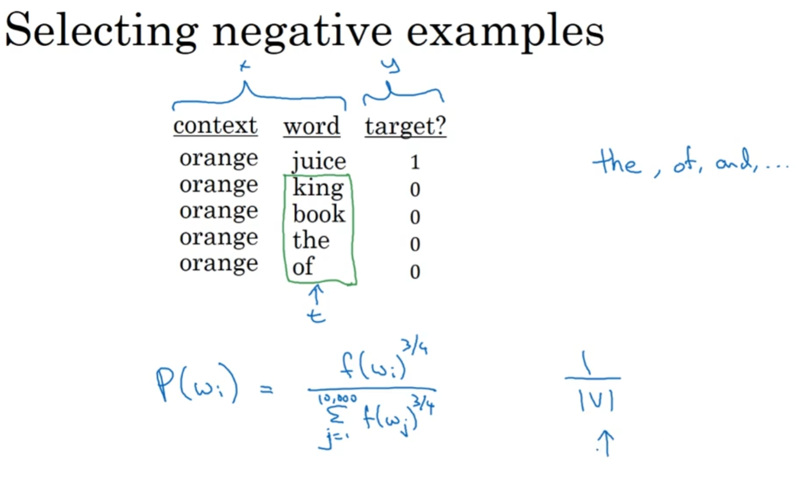

## Sentiment classification

尝试从text推测出情感的程度. 例如对一个餐馆的评价, 如何从一段文本推测出客户心中餐馆的分数呢? 

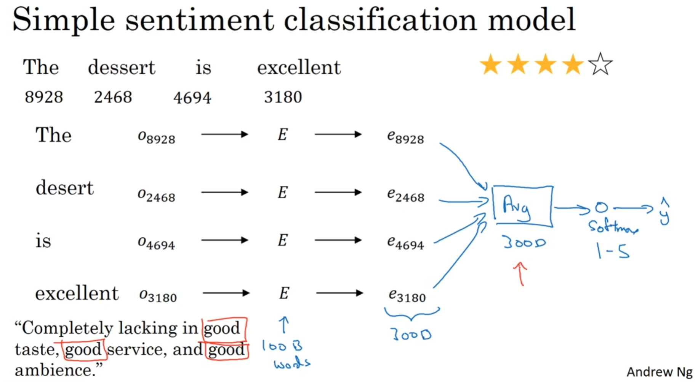

一种方法是所有单词乘以嵌入矩阵之后, 所有的嵌入空间维度的向量求和取平均, 然后这一个向量输入进softmax. 这貌似已经很不错了, 但是其实也有问题: 上图中的负面评论, 出现了三次good, 这很可能导致最后判断的情感是正面的. 

为了解决这种问题, 需要意识到"位置"信息的存在, 因为not的存在, 所以这里的good不是good. 所以说, RNN可以派上用场. 

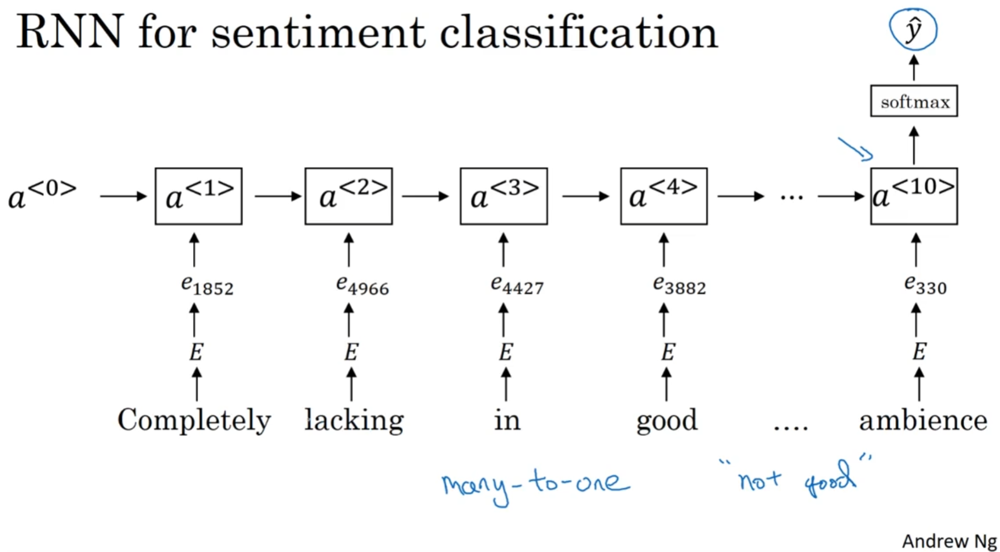

# Sequence to sequence model 

## Basic Model

首先是sequence to sequence model, 考虑一个RNN模型, 单元可以是GNU或者LSTM, 然后要求法英互译. 那么法语文本之后, 每个单词都按照RNN的流程进入模型, 但是最后输出的是一个编码后的矩阵, 然后再用解码器去输出文本, 每输出一个单词之后, 这个输出的单词用作下一个单元的输入(当然这一单元的隐含特征也会输入下一个单元)

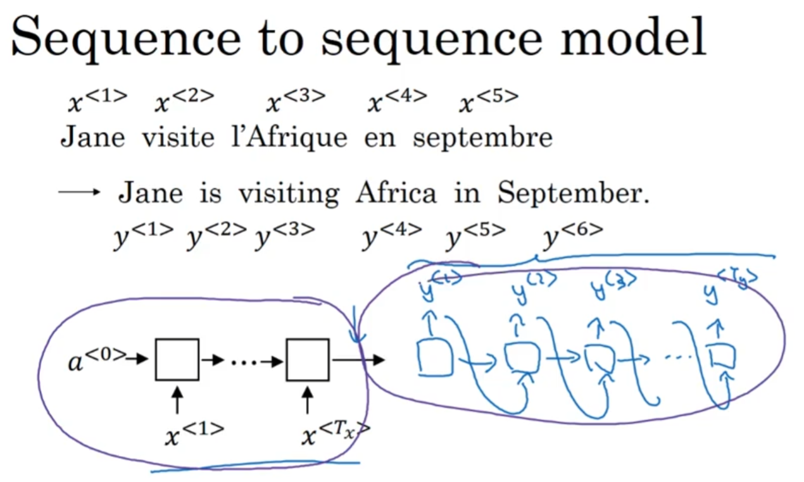

其次就是经典的image captioning任务. 给一张图片, 然后要求生成captioning(描述)文字, 那么就可把卷积之后的特征矩阵输入进RNN模型.

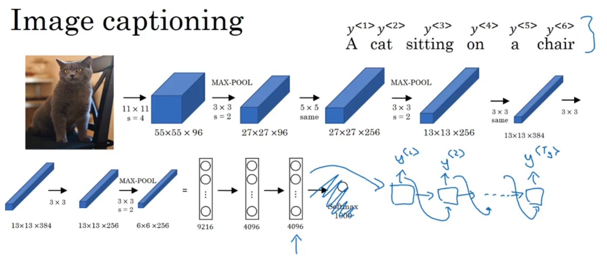

## The most possible sentence

一个languang model 一般来说输入的x0都是零向量, 从而接连输出文本. 那么seq2seq呢? 前面是一个RNN模型, 输出一个"特征隐含矩阵"输入RNN模型, 然后输出文本, 这输出部分和language model非常相似, 因此, 翻译也被称为"Conditional Language Model".

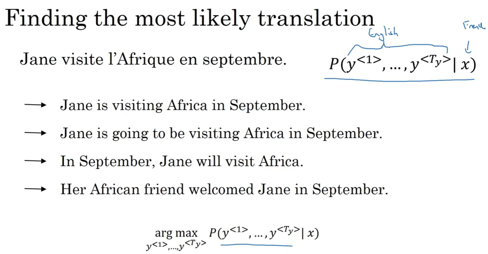

在翻译的输出部分, 我们希望找到合适的y(翻译内容)使得概率最大(x是法语句子). 那么我们将会使用一种叫做beam search(束搜索)的算法. 

为什么没有用贪心算法Greedy search? 贪心算法就是第一个选择可能性最大的选择, 然后根据这个选出可能性最大的第二个, 以此类推. 但是, 局部最优不代表全局最优. 但是我们又不能列举出全部的可能性, 毕竟``vocab_size``非常大. 所以我们用一种近似算法: Beam Search

## 定向搜索--束搜索

贪心算法只能选出可能性最大的第一个单词, 但是束搜索会考虑几个, 这里的"几个"就是Hyper-parameter ``beam width``. 假如说这里是3, 那么就会选可能性最大的三个单词, 然后会储存起来, 各自用于下一步

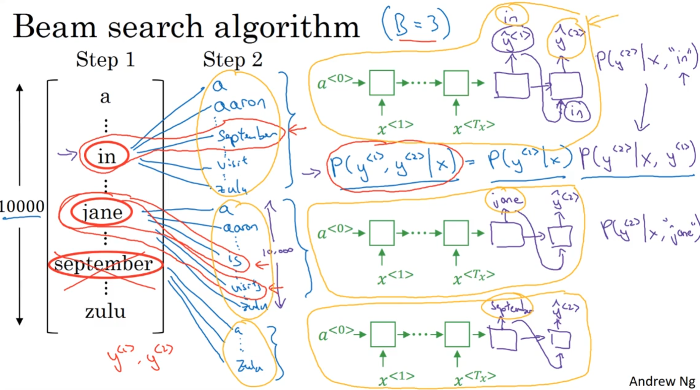

接下来, 跳出来的这这三个单词分别计算vocab_size个单词的各自的概率吗, 然后和前面一个单词的概率相乘, 得到了``P(y1, y2 | x)``. 一共有``beam_width*vocab_size``个概率(这里是30000)个, 然后挑出三个概率最大的组合. 

假如说是``in September   jane is    jane visits``这三个组合的概率是最大的, 则默认我们已经***放弃***了``september``作为第一个单词的可能性. 

最后得到的三个句子(各自都是`<EOS>`结尾的)中挑出一个概率最大的句子.

***Refinements to beam search*** 

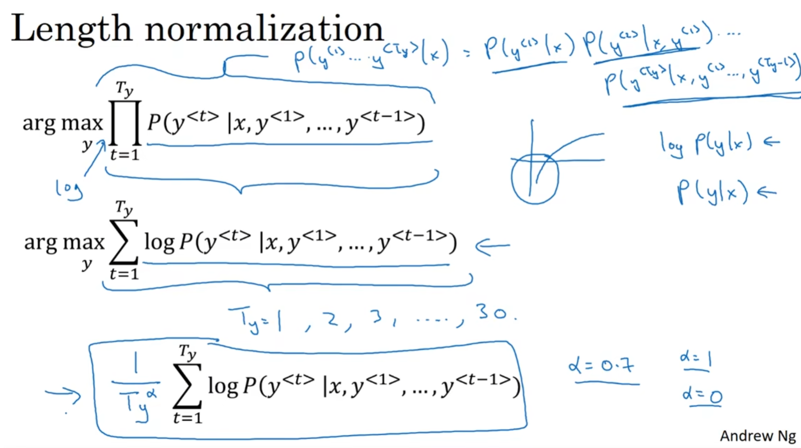

有一个问题: 由于是一堆概率小于0的数字相乘, 得到的结果会非常非常小, 以至于`floating part`甚至不能被计算机精确计算. 因此为了实现转换, 可以使用对数

那么还有一个问题: 既然是一堆log负数相加, 想要概率尽可能地大, 不是相当于生成的单词数量尽可能少吗? 为了解决这个问题, 前面会乘以一个系数`1/Ty^α`, 起到length normalization的作用. 因此, 第三个公式也称为`normalized log likelihood objective`(归一化的对数似然目标函数)

那么如何选择Beam width呢? 参数过大, 那么计算会更加精确, 结果也更有可能是可能性最大的, 但是代价是非常消耗计算资源与时间; 参数过小, 那么计算也许不如之前那么精确(当然比贪心算法是好很多), 但是对计算资源和时间的消耗小. 

束搜索算法是一种近似搜索算法, 也被称为启发式(heuristic)搜索算法

***Error analysis on beam search*** 

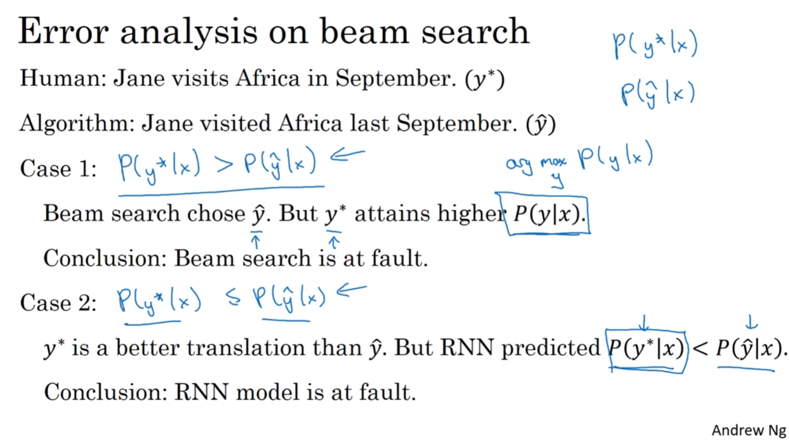

在开发的过程中, 整个模型和RNN与beam search有关, 那么加入说输出了错误的结果, 那么究竟是模型中的哪个地方出了问题呢? 

假如说ground truth认为是y*, 但是给了y^, 那么可以让模型输出一下两个概率, 那么有两种情况: 

1. y*的概率更大, 那么说明明明是``y*``应该被选中, 但是beam search没有选中它, 说明束搜索算法有问题 
2. y*的概率更小, 那么说明束搜索算法没问题, 但是RNN模型错误

