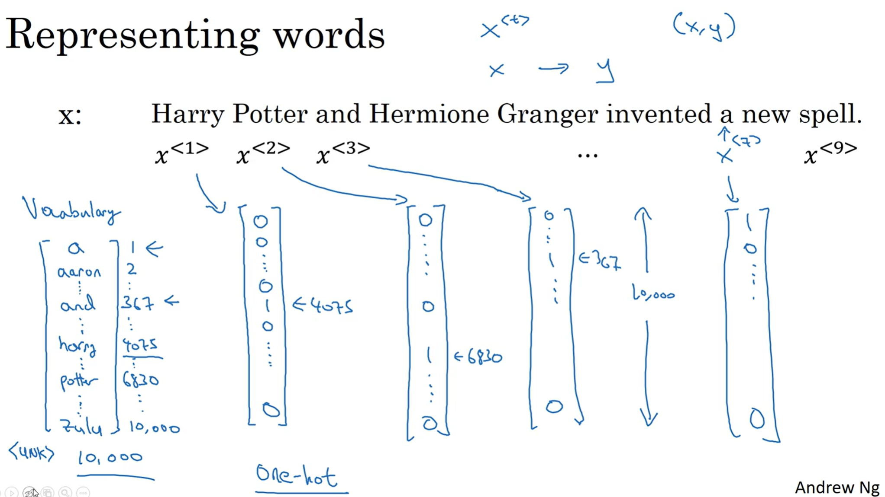
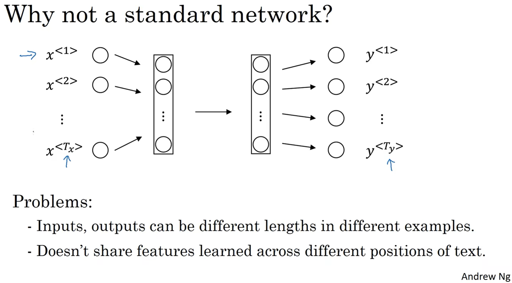
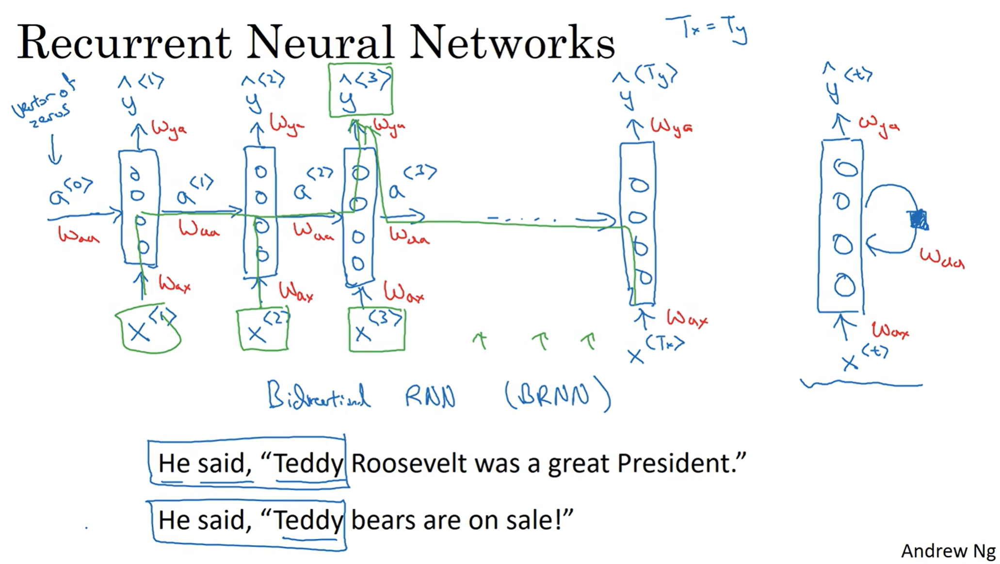
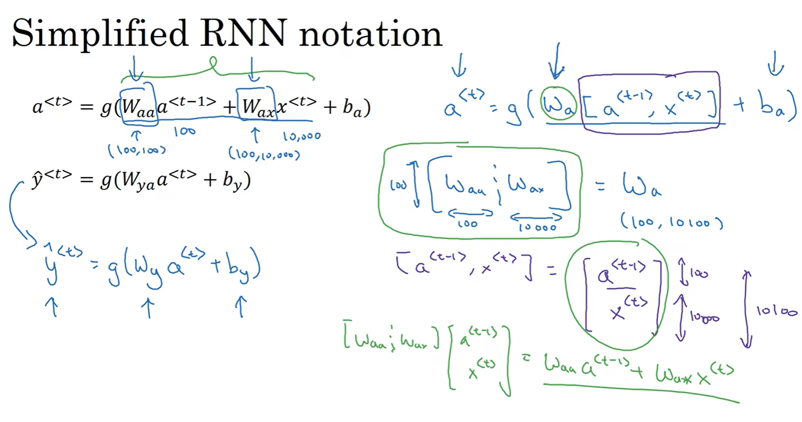
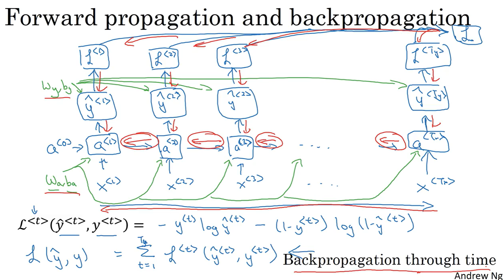
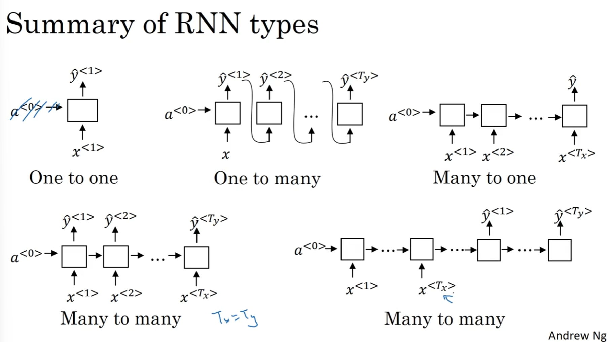
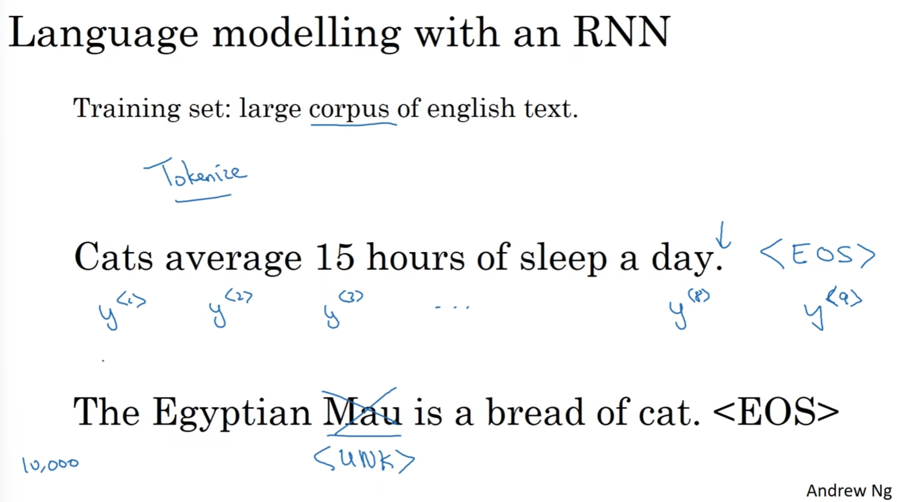

# Sequence Model

序列模型无处不在, 例如音频, 生成文字段落, 等等, 这些数据都是跟序列息息相关 

## Notation 

假如说有一个在句子中找到人名的任务, 输入的是一个包含了9个单词的token, 输出的是, 假如说, 是9个token来表示各自是否是人名的一部分. 那么在这个情景中, 输入的x每一个都是``x^<i>``记号用来表示, y同理. 那么有的是时候处理的数据很多, 那么圆括号就是代表第几个样本, 然后尖括号代表第几个token. 

那么很自然的就能提出疑问: 如何用``x<i>``, 来代表一个单词呢? 

一种直观的解决方法是创建一个字典, 从a, 第一个单词开始, 一直到最后, 假如说是Zulu, 每一个都编上号. 一般来说, 常见的商务公司所使用的字典, 差不多数量在30000-50000, 那么100000以上的也并不少见. 

那么有了这个字典, 那么就可以采用独热编码(One Hot). 假如说我们采用的字典是10000的体量, 那么上面这个例子中, 输入的9个单词中, 每一个单词都可以用10000维的向量表示, 其中只有单词所对应的索引的行数为1, 其他地方都是0. 

那么相当于最后是训练一个从x到y的一个映射. 那么如何训练这样的一个映射呢? 值得注意的是, 这应该是一个监督学习, 因为x y 其实都应该是有标准答案, 且我们会人工标记上去的. 那么因此, 我们引出了RNN

## Recurrent Neural Network

那么首先直觉上可能提出疑问: 为什么不用之前现有的network frame呢? 之前的MLP不是挺好的嘛? 但是主要是有两个问题: 第一个是输出的y的feature的数量其实是不确定的(不是所有的任务都是像这一个任务一样, y输出的feature的数量和x的一样); 第二个是这样的神经网络无法学习positional information, 因为原来的神经网络是permutation-insensitive的, 但是序列却对permutation异常敏感. 

那么什么是RNN ? 

y1的输出来源于x1, 但是到了y2的时候, 不仅仅它的推理来源于x2, 还要源于前一个模块所传递过来的a1, 然后就这样一直以此类推. 那么对于y1来说, 它的推理其实也需要一个a0, 但是一般这个a0都是零初始化. 

值得注意的是, 输入的x需要经过一层映射处理, 才能进入网络, 而这个映射矩阵的参数是共享的; 同样, 输出y的时候, 其实是输出内容经过一层映射处理才变成y的, 而这层映射矩阵也是参数共享的; 更是不仅仅如此, 传递``a<t>``的时候, 也是某种输出经过映射矩阵变成的, 而这层映射矩阵的参数也是共享的. 共享是什么意思? 意思指的是每一个模块中的这个矩阵的参数总是一样的

在有些教科或者论文中, 为了方便, 将RNN表示成右边这个样子. 

在这个模型中, 发现y3的输出与x1 x2 x3有关, 这是一件非常乐于见到的事情. 但是也有缺点. 有的时候, 其实序列模型的"序列问题"不仅仅是后面的token和前面的有关, 有的时候(且不少见)前面token的含义也和后面的token有关, 但是这一点在模型中没有体现. 图中列举出了一个很生动的例子, 关于Teddy究竟是不是人名. 

那么为了解决这种弊端, 我们可以考虑双头循环网络(BRNN), 这个之后会介绍. 

那么``Wax Waac Wya``参数起到的作用究竟是什么呢?  注意到字母的排列有点奇怪, 因此首先先明确字母的含义: 第一个字母代表: 用来计算什么; 第二个字母代表: 这个矩阵是乘在谁身上. 

``a<t> y<t>``的计算式子已经放在了图片里面, 其中g代表激活函数, 那么这个激活函数在计算``a<t>``的时候大多是tanh函数, 很少但是也可以用ReL:U函数; 而对于``y<t>``来说, 主要取决于输出类型是什么, 是softmax还是sigmoid, 都有可能. 

为了进一步简化符号以用来表示复杂的网络, 用向量化的形式进一步简化: 

 ## Backward Propagation through time 

虽然说在实际的编程中, 我们完全不需要知道backward propagation究竟是怎么进行的, 因为pytorch功能过于强大. 但是最好还是稍微了解一下反向传播究竟是如何进行的

向前传播的过程之前已经说过, 那么关于损失函数, 依然使用的是各自的交叉熵函数; 之后反向传播过程与之前的方向完全相反, 以这个来实现链式法则的求导, 来计算出各个节点的参数的delta值, 最后实现梯度下降和参数更新. 因为之前正向传播的方向正好是时间方向, 因此反向传播就有了一个非常fancy的名字: Backward Propagation through time.

## 不一样的RNN

之前介绍和分析的这种情况都是Tx = Ty, 即输入的token数量和输出的token数量一致. 但是很多情况并不是这样. architecture分为很多种, 例如many-to-many(之前的那个就是), 也有many-to-one(例如sentiment classification, 最后输出的是一个正整数, 代表心情好坏程度)

当然还有one-to-many, 例如输入一个正整数代表音乐风格, 然后输出是一段音频. 在many-to-many中还有一种非常特殊的结构, 首先用encoder读入这句话, 然后再用decoder输出翻译的内容, 这种结构最出名的使用在不同于语言之间的翻译, 因为翻译的句子之间的token数量非常有可能是不一样的. 

## Language model and sequence generation

一个良好的语音识别系统在听到一句话之后会计算出各种可能句子的概率, 然后再比较概率最后输出最有可能的文本. 那么如何建立这样的模型呢? 首先, Training set需要是一个包含英语文本的非常大的语料库(corpus). 

对于语料库的每一个句子, 首先我们需要tokenize, 即用one hot编码. 但是值得注意的是, 最后可以加上一个``<EOS>``的token, 代表此处是End of Sentence. 同时, 如果发现了字典里面没有的单词, 可以用``<UNK>``token代表Unknown

这里训练的目的是: 告诉Cat, 然后生成后面一个单词; 错了没关系, 我再告诉你, Cat 后面是 Average, 那么Average后面又是什么呢? 这样的话就能计算一堆的条件概率. 

## Vanishing Gradient & GRU

英语的句子能做到非常长, 例如上面这个例子, 我们希望网络能够学到: 后面是was 还是 were是需要根据前面cat的单复数来决定的, 但是网络非常深, 因为中间单词非常多, 于是深度很高,导致梯度容易爆炸, 因此反向训练很难进行. 

为了结局这个问题, GRU(Gated Recurrent Unit)应运而生, 它能敏感捕捉深层连接, 并且极大缓解梯度爆炸的问题. 

