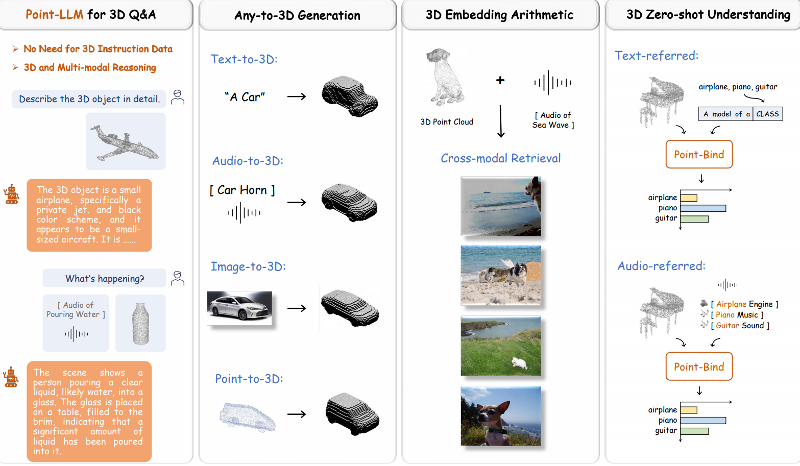
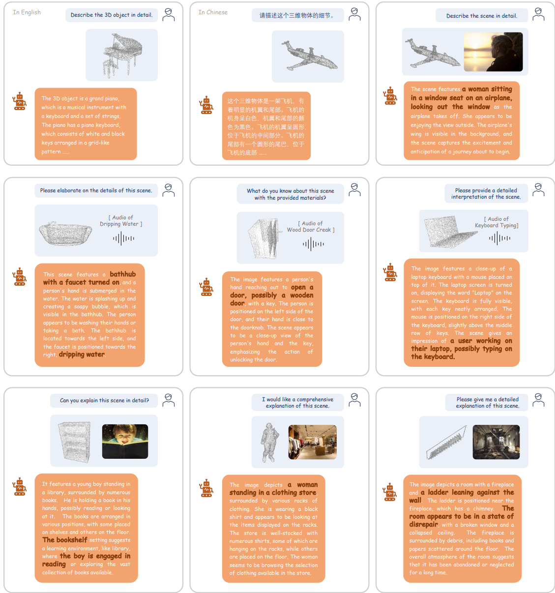
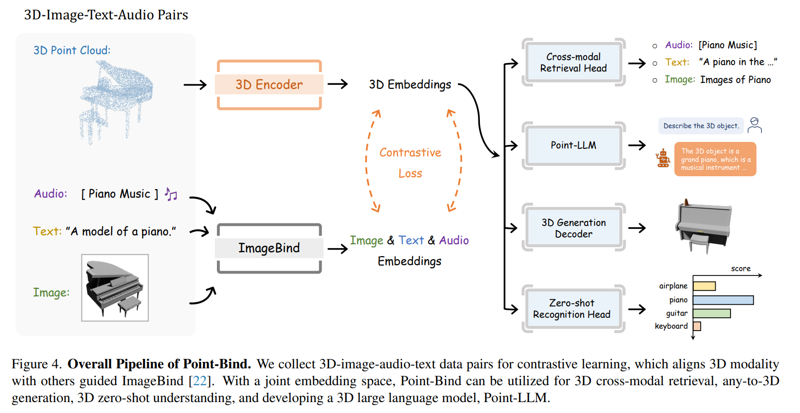
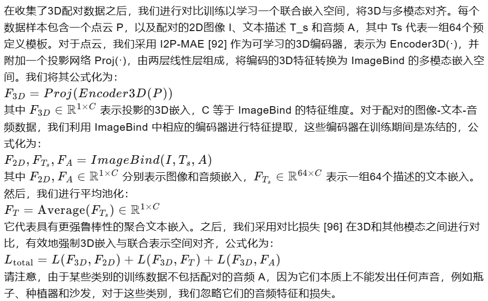
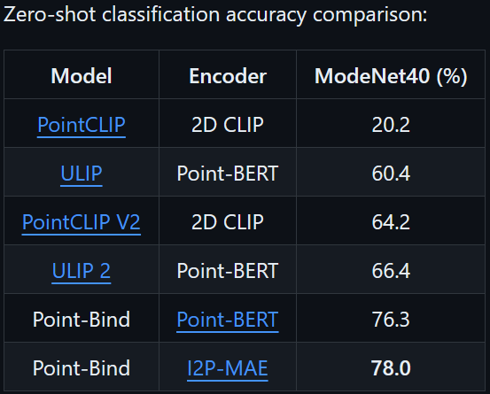

# Point-Bind & Point-LLM

## 前言 

**摘要部分:** 我们介绍了 Point-Bind，这是一个3D多模态模型，它将点云与2D图像、语言、音频和视频对齐(aligning with)。在 ImageBind 的指导下，我们构建了一个3D与多模态之间的联合嵌入空间，使得许多有前景的应用成为可能，例如，任何模态到3D的生成、3D嵌入空间算术以及3D开放世界理解。在此之上，我们进一步提出了 PointLLM，这是**第一个遵循3D多模态指令的大型语言模型（LLM）**。通过参数高效的微调技术，Point-LLM 将 Point-Bind 的语义注入到预训练的 LLM 中，例如 LLaMA，它不需要3D指令数据，但展现出卓越的3D和多模态问答能力。我们希望我们的工作能够为行业提供帮助，将3D点云扩展到多模态应用.

**Introduction:**  

***我们能否构建一个3D与多模态之间的联合嵌入空间，以实现统一的3D理解、生成和指令跟随？***

什么是 Point-Bind? "Point-Bind" 是论文中提出的一个3D多模态框架，它的核心目的是将3D点云数据与其他模态的数据（如2D图像、文本、音频和视频）对齐，以便在这些不同的数据类型之间建立一个联合的嵌入空间（joint embedding space). 

这是一个用于通用3D分析的3D多模态框架，它将点云与多种模态对齐，如图1所示。具体来说，我们收集了3D-图像-文本-音频对作为训练数据，并在 ImageBind 的指导下构建了一个联合嵌入空间。我们采用了一个可训练的3D编码器（例如 I2PMAE [92]）提取的特征与 ImageBind 中冻结的多模态编码器之间的对比损失。这样一个简单的策略可以有效地将不同的模态整合到一个统一的表示空间中，并允许在图2中进行各种以3D为中心的多模态任务。

这样做的目的是为了实现以下几个关键功能：

1. **多模态对齐**：通过一个统一的框架，将3D点云与多种模态的数据进行对齐，使得它们可以在一个共享的空间中被理解和处理。
2. **3D理解**：改进对3D几何形状的理解，尤其是在开放世界的场景中，即在未见过的类别或环境中识别和理解3D对象。
3. **3D生成**：实现从任何模态到3D的生成，即不仅仅是文本到3D，还可以是图像、音频到3D的生成。
4. **3D指令跟随**：开发出能够遵循3D指令的大型语言模型（LLM），这些模型能够理解和响应与3D点云相关的自然语言指令。

如下面的图:


作者希望用一种unified framwork去统一点云, 图片, 声音和语言的信息. 

在此基础上，我们进一步提出 PointLLM，这是第一个遵循3D多模态指令的大型语言模型（LLM）。通过参数高效的微调技术，Point-LLM 将 Point-Bind 的语义注入到预训练的 LLMs 中，例如 LLaMA，它不需要3D指令数据，但展现出卓越的3D和多模态问答能力。





## Point-Bind Pipeline



1. **多模态输入**：Point-Bind 接受多种模态的输入，包括3D点云、2D图像、文本和音频。
2. **3D编码器**：使用一个***可训练的3D编码器（例如 I2P-MAE）来处理3D点云数据***，并将其编码为特征表示。
3. **投影网络（Projection Network）**：3D编码器的输出通过一个投影网络，该网络由两层线性层组成，***将3D特征映射到与ImageBind相同的多模态嵌入空间***。
4. **ImageBind 编码器**：对于图像、文本和音频模态，Point-Bind 利用 ***ImageBind 中预训练的对应编码器***来提取特征。
5. **对比损失（Contrastive Loss）**：通过***对比损失函数***，使得3D点云的特征与其它模态的特征在联合嵌入空间中对齐。
6. **联合嵌入空间**：所有模态的特征被映射到一个共享的嵌入空间中，这允许跨模态的交互和理解。

那么关于衡量损失的问题, 文章的3.3节详细阐述了相关的内容: 



注意的是, ImageBind模型的参数是训练好直接拿过来用的, 而可以训练的是点云映射进嵌入空间的参数 

那么数据集是哪里来的呢? 

1. **3D-Image-Text Pairs**：Point-Bind 使用了来自 ULIP [84] 的数据对，这些数据对包括从 ShapeNet [8] 构建的3D、图像和文本三元组。ShapeNet 是一个常用的数据集，包含了大量的3D CAD模型。每个3D点云与描述其空间形状语义信息的文本配对，以及通过多视图图像渲染生成的2D图像对应物。文本描述由类别名称的同义词集和64个预定义模板构建。
2. **3D-Audio Pairs**：为了提供更多的对比信号，研究者还从 ESC-50 [51] 和 ShapeNet 数据集中收集了3D和音频的数据对。首先，他们从 ShapeNet 的55个类别中选择了那些在现实世界中能发出声音的对象类别，例如“飞机”、“时钟”、“洗衣机”和“键盘”。然后，他们保留了那些同时也在 ESC-50 数据集中的类别。通过这个标准，他们获得了9个类别的3D-音频配对数据，包含大量的音频剪辑。
3. **3D-Image-Audio-Text Pairs Construction**：最后，将每个3D-音频对与其对应的3D-图像-文本数据匹配，从而形成了一个统一的3D-图像-音频-文本数据集，包含广泛的跨模态对。在训练过程中，同时对点云及其配对的三种模态数据进行对比学习。

**By the way, 什么是zero-shot task?**

**"Zero-shot task"（零样本任务）**是机器学习中的一个术语，指的是模型在没有看到某些类别的任何训练样本的情况下，对这些类别进行预测或分类的任务。这通常发生在模型被训练来识别或执行某些任务，然后在实际应用中遇到了它从未见过的新类别或新任务。

在零样本学习（Zero-Shot Learning，ZSL）的场景中，模型需要利用在训练阶段学到的知识来推断或识别新的类别。这通常通过以下方式实现：

1. **语义特征**：模型在训练时学习到的语义特征或属性，这些特征可以迁移到新的类别上。
2. **类别描述**：使用文本描述来提供新类别的信息，模型通过理解这些描述来学习识别对应的类别。
3. **通用嵌入空间**：创建一个通用的嵌入空间，其中不同类别的特征被映射到这个空间中，使得即使没有直接训练，模型也能够通过比较特征的相似性来进行分类。

零样本任务对于提升模型的泛化能力和适应性非常重要，特别是在现实世界的应用中，模型经常需要处理训练时未遇到的新情况。

在论文 "Point-Bind & Point-LLM" 的上下文中，"3D Zero-shot Understanding" 指的是模型在没有直接训练数据的情况下，对3D形状进行分类和理解的能力。这可能涉及到模型使用跨模态的信息（如文本或图像描述）**来识别和推理它从未直接见过的3D对象。**

## Point-Bind代码解读

首先, 论文中提到, 3D点云编码器的不同, 会导致性能(zero-shot task)上有所差异. 在进行了实验之后, 发现I2P-MAE是一个更好的Encoder, 但是Point-BERT也是十分不错的编码器: 



意味着, 定义后的模型, 应该能够支持多种传输的Encoder: (即Encoder类型能够作为参数传进去, 因此需要额外定义函数)

````python
def PointBind_PointBERT(args):
    vision_model = timm.create_model('vit_base_patch16_224', num_classes=0)
    config = cfg_from_yaml_file(POINTBERT_CONFIG)
    point_encoder = PointTransformer_BIND(config.model, args=args)
    model = POINTBIND(point_encoder, pc_feat_dims=768)
    return model

def PointBind_I2PMAE(args=None):
    vision_model = timm.create_model('vit_base_patch16_224', num_classes=0)
    point_encoder = I2P_MAE_BIND()
    model = POINTBIND(point_encoder, pc_feat_dims=384)
    return model
````

其中, 这行代码: ``vision_model = timm.create_model('vit_base_patch16_224', num_classes=0)``

执行以下操作：

1. **导入 `create_model` 函数**：`create_model` 函数来自 `timm` 库，`timm` 是一个流行的Python库，它提供了一系列预训练的、最先进的（SOTA）图像分类模型。
2. **创建模型实例**：使用 `create_model` 函数创建一个名为 `vision_model` 的模型实例。这个特定的函数调用创建了一个基于 Vision Transformer (ViT) 的模型，其变种为 `vit_base_patch16_224`。这个模型是针对图像分类任务预训练的，并且在这个上下文中可能被用作多模态学习系统中的图像特征提取器。
3. **`vit_base_patch16_224` 参数**：这个参数指定了要创建的 Vision Transformer 模型的变种。这里，`vit_base_patch16_224` 指的是一个基础版本的 ViT 模型，它使用16x16像素的补丁（即图像块），并且输入图像的大小是224x224像素。
4. **`num_classes=0` 参数**：这个参数指定了模型在最后一层全连接层（通常用于分类任务）中的输出类别数。在这里，`num_classes=0` 表示不添加任何分类头，即模型将不会用于直接的分类任务，而只会提取图像特征。

但是创建出来的新的vision_model貌似并没有被直接使用. 因此此处不过多纠结

总而言之, 这两个函数返回了制定3D点云Encoder的Point-Bind模型. 

下面导入了一堆东西: 

````python
from collections import OrderedDict
import ipdb
from PIL import Image
from imagebind.imagebind_model import ModalityType
from torchvision import transforms
from imagebind import imagebind_model

import timm
from torch import nn
from data.dataset_3d import  *

from torch.nn.parameter import Parameter
from easydict import EasyDict
# 导入两个Encoder, 用于之后指定Encoder的函数
from models.pointbert.point_encoder import PointTransformer_BIND
from models.i2p_mae.I2P_MAE import I2P_MAE_BIND
POINTBERT_CONFIG = './models/pointbert/PointTransformer_8192point.yaml'
````

下面正式开始是模型相关的代码了:

 ````python 
 class LayerNorm(nn.LayerNorm):
     """Subclass torch's LayerNorm to handle fp16."""
 
     def forward(self, x: torch.Tensor):
         orig_type = x.dtype
         ret = super().forward(x.type(torch.float32))
         return ret.type(orig_type)
 
 class QuickGELU(nn.Module):
     def forward(self, x: torch.Tensor):
         return x * torch.sigmoid(1.702 * x)
 ````

