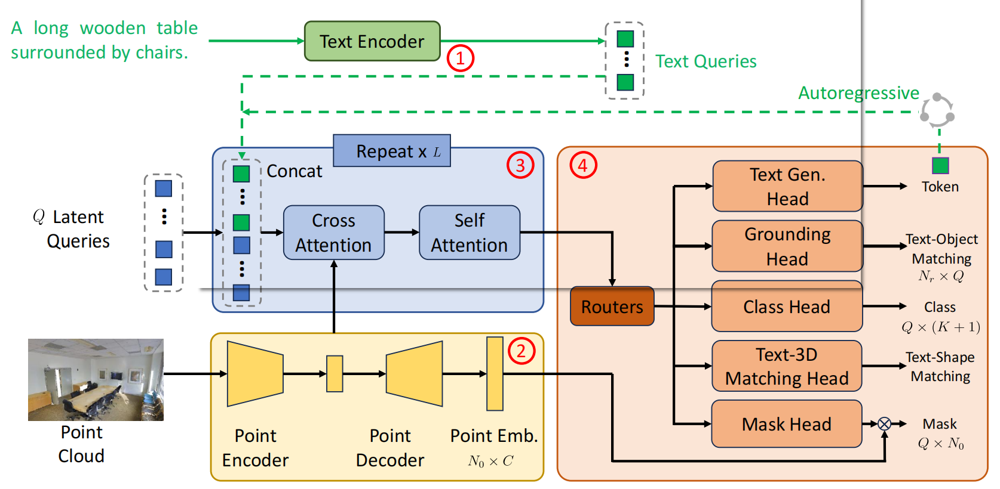

# Uni3DL

这篇论文的摘要部分提出了一个名为Uni3DL的统一模型，它用于3D和语言理解。与现有的3D视觉-语言模型不同，Uni3DL不依赖于投影的多视图图像，而是直接在点云上操作。这种方法显著扩展了3D中支持的任务范围，包括视觉和视觉-语言任务。Uni3DL的核心是查询变换器(query transformer)，它通过关注3D视觉特征来学习任务不可知的语义和掩码输出，同时使用任务路由器来选择性地生成各种任务所需的特定任务输出。Uni3DL模型采用统一的架构，实现了任务分解和跨任务的大量参数共享。Uni3DL在多种3D视觉-语言理解任务上进行了严格的评估，包括语义分割、目标检测、实例分割、视觉定位、3D字幕生成和文本-3D跨模态检索。它展示了与或超越了特定任务的最新技术（SOTA）模型的性能。作者希望他们的基准和Uni3DL模型将成为未来3D和语言理解统一模型研究的坚实一步。

Uni3DL是一个多功能的架构，专为各种3D视觉-语言任务设计，包括3D目标分类、文本到3D的检索、3D字幕、3D语义和实例分割以及3D视觉定位。该架构包括四个核心模块：文本编码器用于文本特征提取；点编码器致力于点特征学习；查询变换模块包含一系列交叉注意力和自注意力层，用于学习对象和文本查询与点编码器体素特征之间的关系；任务路由器，可适应并包含多个功能头，包括用于生成文本输出的文本生成头、用于目标分类的类别头、用于生成分割掩码的掩码头、用于文本到对象定位的定位头，以及用于3D文本跨模态匹配的3D文本匹配头。通过组合这些功能头，任务路由器可以为不同任务选择性地组合功能头。例如，实例分割任务结合了目标分类和掩码预测。给定输入点云P，我们的Uni3DL利用3D U-Net EI提取层次化的体素特征V，以及文本编码器ET获得文本特征FT ∈ RLT ×C。体素特征、文本特征以及可学习的潜在查询FQ ∈ RQ×C被输入到统一的解码网络中，以预测掩码和语义输出

我们的点特征提取网络架构采用了基于MinkowskiEngine框架的稀疏3D卷积U-Net结构，包括编码器和解码器网络。彩色输入点云，表示为P ∈ RN0×6，经过量化到N0个体素，表示为V0 ∈ RN0×3，每个体素捕获其所包含点的平均RGB颜色作为初始体素特征。连续应用多个卷积和下采样层以提取高级体素特征，然后通过解卷积和上采样层恢复体素到原始分辨率。假设U-Net有S个特征块阶段，每个阶段s ∈ [1, .., S]，我们可以得到体素特征Vs ∈ RNs×Cs，其中Ns表示阶段s的有效力体素数量，Cs表示相应的特征维度。然后我们将所有体素特征投影到相同的维度D，得到一组特征图{Vs ∈ RNs×C}S s=1。最后一个特征图(VS)用作点嵌入以计算每个点的掩码，而其余的特征图{Vs}S−1 s=1被输入到变换器模块以增强潜在和文本查询。对于文本输入，我们使用CLIP分词器以及基于变换器的网络进行文本特征学习。

我们遵循基于查询的变换器架构[8, 43, 56, 84]设计我们的解码器网络。给定体素特征{Vs}S−1 s=1，我们的变换器模块通过L个解码器层的序列来细化潜在查询FQ和文本查询FT。在每层l = [1..., L]，我们通过交叉关注体素特征{Vs}S−1 s=1来细化查询

我们重复这个过程，每个特征级别s = [1, 2, ..., S − 1]。掩码注意力。为了增强对象定位能力，我们遵循Mask2Fomer[17]中的注意力块设计，并使用掩码注意力而不是普通的交叉注意力，其中每个查询只关注前一层预测的掩码体素。体素采样。一批点云通常具有不同数量的点，导致不同的体素数量。当前的变换器实现通常要求每个批次条目中输入的长度固定。为了使批量训练有效，对于每个特征级别s，在将体素特征输入到解码器网络之前，我们采样体素特征，然后在所有交叉注意力层中使用这些采样的体素特征[56]。我们通过自注意力层和前馈层进一步增强对象和文本查询

设计可学习的潜在查询（latent query）与文本进行拼接（concatenation）主要是为了使模型能够更好地联合编码来自不同源（如视觉数据和语言数据）的信息。在Uni3DL模型中，潜在查询与文本特征的结合有以下几个潜在的好处：

1. **多模态特征融合**：通过将来自点云的潜在查询与文本特征结合，模型可以学习到一个融合了视觉和语言信息的联合表示。这种融合有助于模型理解场景的上下文和语义内容。
2. **增强的表征能力**：潜在查询可以捕获点云数据中的几何和结构信息，而文本特征则提供了描述性的语义信息。将这两种类型的信息结合起来，可以增强模型对3D场景和相关语言描述的整体表征能力。
3. **灵活性和适应性**：可学习的潜在查询意味着模型可以自动调整其内部表示以适应不同的任务需求。这种设计提供了一种灵活的方式来适应各种3D视觉-语言任务。
4. **任务特定的调整**：通过在不同任务中使用不同的潜在查询，模型可以为特定任务调整其表征，从而提高任务性能。
5. **参数共享和效率**：通过共享潜在查询和文本特征的参数，模型可以在不同的任务之间复用知识，这有助于减少总体参数数量，提高训练和推理的效率。
6. **上下文理解**：在处理语言任务时，如字幕生成或视觉定位，上下文信息非常重要。潜在查询与文本的结合可以帮助模型更好地理解给定文本描述的上下文，从而生成更准确的输出。
7. **端到端学习**：这种设计允许模型在一个统一的框架内端到端地学习处理多种任务，从而简化了训练流程并可能提高最终性能。